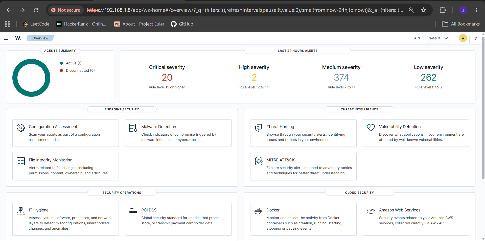
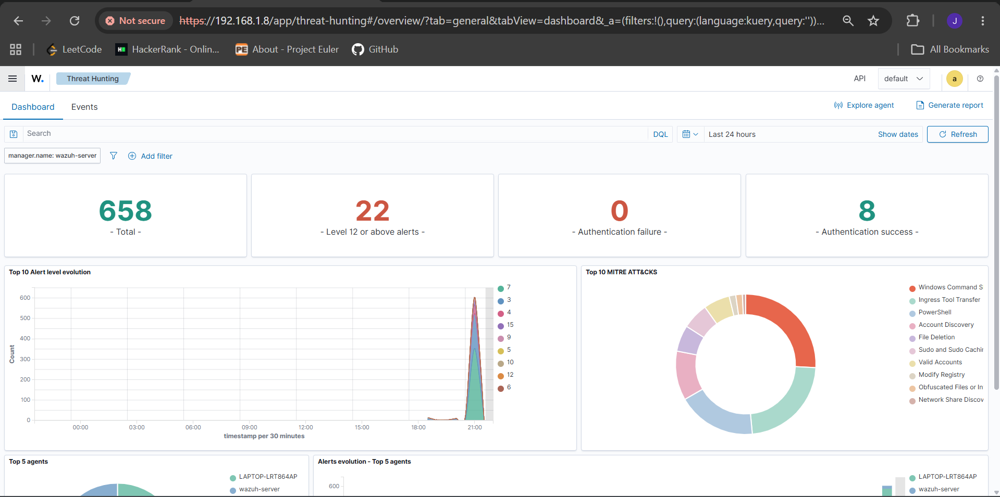
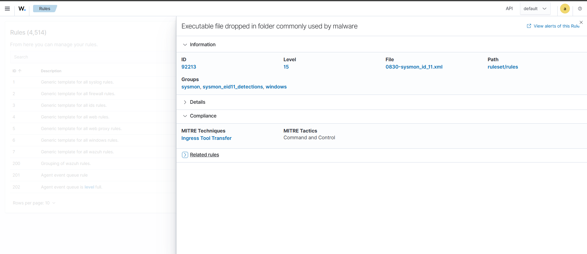
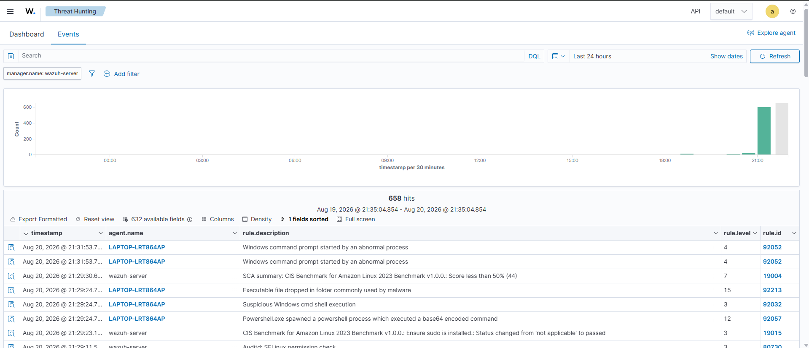

# Wazuh SOC Home Lab — Endpoint Detection & MITRE ATT&CK Mapping

## Overview

This is a home lab built to practice SOC analyst / blue team skills — deploying a SIEM, generating realistic attack telemetry, and validating detection coverage against the MITRE ATT&CK framework. The goal was to go beyond tutorials and build a working pipeline: install and configure Wazuh, onboard a monitored endpoint, simulate adversary behavior using industry-standard tooling, and analyze the resulting alerts like a real triage workflow.

This project is a work in progress and will continue to expand (see [Next Steps](#next-steps)).

## Architecture

```
┌─────────────────────┐         ┌──────────────────────────┐
│   Kali Linux (VM)    │  attacks │  Windows 11 Host         │
│   Attacker machine   │─────────▶│  Monitored endpoint       │
│                       │         │  - Wazuh Agent            │
│   - Nmap              │         │  - Sysmon (SwiftOnSecurity│
│   - Hydra              │         │    config)                │
└─────────────────────┘         │  - Atomic Red Team         │
                                  └───────────┬──────────────┘
                                              │ logs / alerts
                                              ▼
                                  ┌──────────────────────────┐
                                  │  Wazuh Manager (VM)       │
                                  │  - Manager                │
                                  │  - Indexer                │
                                  │  - Dashboard               │
                                  └──────────────────────────┘
```

**Network:** All three machines run on the same bridged local network so the attacker VM can reach the monitored endpoint, and the endpoint can forward logs to the Wazuh manager.

## Tools Used

| Tool | Purpose |
|---|---|
| Wazuh 4.14.6 | SIEM / XDR platform — manager, indexer, and dashboard |
| Sysmon (SwiftOnSecurity config) | Endpoint telemetry — process creation, network connections, registry changes |
| Atomic Red Team | Safe, MITRE-mapped adversary simulation on the Windows endpoint |
| Kali Linux | Attacker machine — reconnaissance and brute-force simulation |
| Nmap | External network reconnaissance against the monitored endpoint |
| Hydra | Brute-force authentication testing |

## Setup Summary

1. Deployed Wazuh manager, indexer, and dashboard via the official OVA in VirtualBox.
2. Registered a Windows 11 host as a monitored endpoint using the Wazuh agent.
3. Installed Sysmon with the SwiftOnSecurity configuration for high-fidelity process, network, and registry telemetry, and added the Sysmon event channel to the agent's log collection config.
4. Set up Kali Linux on the same network segment to act as an external attacker.
5. Installed Atomic Red Team on the Windows endpoint to safely execute real, MITRE-mapped attack techniques.
6. Ran a mix of Atomic Red Team tests and Kali-driven network attacks, then reviewed the resulting alerts in the Wazuh dashboard.

## Attack Simulation

The following techniques were executed against the monitored endpoint:

| MITRE Technique | Tactic | Test Description |
|---|---|---|
| T1082 | Discovery | System Information Discovery — collected host, OS, and network configuration details |
| T1059.001 | Execution | PowerShell Command Execution — ran commands via PowerShell |
| T1053.005 | Persistence | Scheduled Task Startup Script — created scheduled tasks for persistence |
| T1547.001 | Persistence | Registry Run Key — added a registry autorun entry |
| — | Reconnaissance | Nmap service/version scan from Kali against the monitored endpoint |
| — | Credential Access | Hydra brute-force attempt against a test account |

## Detections & MITRE ATT&CK Mapping

Wazuh's built-in Sysmon-based ruleset generated the following alerts in response to the simulated activity:

| Wazuh Rule ID | Description | Severity (Level) | MITRE Technique / Tactic |
|---|---|---|---|
| 92213 | Executable file dropped in folder commonly used by malware | 15 (Critical) | Ingress Tool Transfer — Command and Control |
| 92057 | Powershell.exe spawned a powershell process which executed a base64 encoded command | 12 (High) | Obfuscated Files or Information — Defense Evasion |
| 92041 | Value added to registry key has Base64-like pattern | 10 (Medium) | Modify Registry — Defense Evasion |
| 92205 | Powershell process created an executable file in Windows root folder | 9 (Medium) | Ingress Tool Transfer |
| 92052 | Windows command prompt started by an abnormal process | 4 (Low) | Windows Command Shell — Execution |
| 92027 | Powershell process spawned powershell instance | 4 (Low) | PowerShell — Execution |
| 92032 | Suspicious Windows cmd shell execution | 3 (Low) | Windows Command Shell — Execution |
| 92034 | Discovery activity spawned via cmd shell execution | 3 (Low) | Account/System Discovery |
| 61638 | Sysmon - Suspicious Process - dllhost.exe | 12 (High) | Flagged automatically during monitoring, investigated and assessed as benign endpoint behavior (see [Triage Notes](#triage-notes)) |

### 24-Hour Alert Summary (from Wazuh Overview dashboard)

| Severity | Count | Rule Level Range |
|---|---|---|
| Critical | 20 | 15+ |
| High | 2 | 12–14 |
| Medium | 374 | 7–11 |
| Low | 262 | 0–6 |

## Screenshots


*24-hour alert severity summary from the Wazuh Overview dashboard.*


*Top 10 MITRE ATT&CK techniques triggered, visualized in the Threat Hunting dashboard.*


*Wazuh's rule detail view for rule 92213, showing the official MITRE Technique ("Ingress Tool Transfer") and Tactic ("Command and Control") mapping.*


*Filtered event table showing detections generated from Atomic Red Team execution.*

## Triage Notes

During testing, rule **61638 ("Sysmon - Suspicious Process - dllhost.exe")** fired at level 12 (High) without being tied to a deliberate test. This was investigated by reviewing the associated process details in the raw event — `dllhost.exe` is a legitimate Windows COM Surrogate process, and in this case the alert was triggered by normal system activity rather than malicious behavior. This is a common source of false positives in endpoint monitoring and is documented here as an example of triage reasoning: not every high-severity alert indicates a real incident, and confirming context before escalating is a core part of the analyst workflow.

## Challenges & Troubleshooting

Building this lab surfaced a number of real operational issues, which were diagnosed and resolved along the way:

- **PowerShell execution policy** blocked Atomic Red Team's dependencies from loading — resolved by scoping `Set-ExecutionPolicy RemoteSigned` to the current session/user rather than disabling it system-wide.
- **Disk space exhaustion** on the Wazuh manager VM (`/var/ossec` grew to 21GB) — root-caused to full event archiving (`logall`) being enabled by default, which logs every raw event rather than just alerts. Resolved by disabling `logall`/`logall_json` in `ossec.conf`.
- **Clock drift / timestamp mismatch** between the Wazuh manager and the monitored endpoint made recent alerts appear to be missing from search results — resolved by enabling NTP sync (`timedatectl set-ntp true`) and setting the correct timezone on the manager VM.
- **Agent re-registration** after rebuilding the Wazuh manager required updating the stale manager IP in the agent's `ossec.conf` and re-running `agent-auth` to obtain a fresh key.

## Next Steps

- Write custom Wazuh detection rules (`local_rules.xml`) for behavior not covered by the default ruleset.
- Build a dedicated MITRE ATT&CK-mapped dashboard combining alerts from all tactics observed.
- Expand endpoint coverage with a second monitored host (Linux) for cross-platform detection comparison.
- Layer a Splunk instance on top of Wazuh-forwarded data to gain SPL/correlation search experience alongside Wazuh's native detections.

## Author

Built as part of an ongoing effort to build practical, hands-on SOC analyst skills ahead of applying for SOC Analyst / Security Operations internship and entry-level roles.
